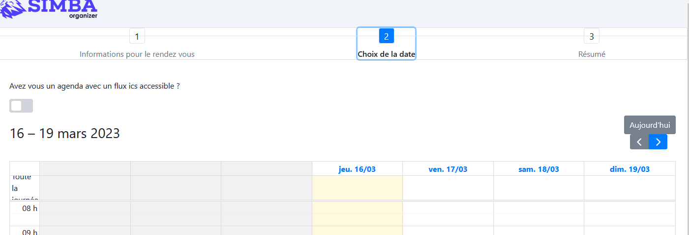

## Find a bug

Clone the [Simba Organizer repository](https://github.com/selabs-ur1/doodle) and follow the instructions to run the application on your machine.

Find a bug in the application. 

With the help of Selenium and the Page Object Model desing pattern write a simple test that fails for this bug.

Optionally make a pull request to the project.

Include in this document the code of the test and, if you did it, the link to the pull request.

## Answer

The bug we found was that on the creation of a poll, it is possible to access the second page of the creation without having filled the first page. This could be done by clicking on the second page button before filling the first page :

A test demonstrating this bug is available in the following file: [PollPageTest.java](../code/exercise3/src/test/java/fr/istic/vv/tp5/BugTest.java)
